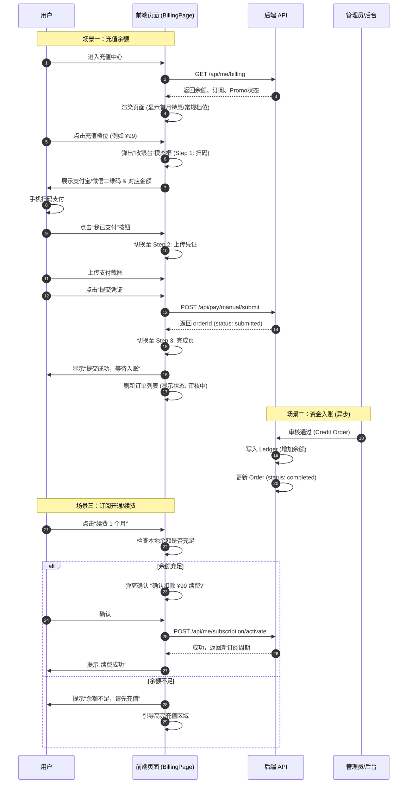

# 充值页面 (Billing Page) 交互重构设计 2026

本文档描述了“充值中心”页面的新版设计，重点优化用户充值与订阅的交互体验。

## 1. 核心目标

*   **分离关注点**：将“账户余额充值”与“订阅续费”在视觉上区分，但逻辑上关联（订阅消耗余额）。
*   **引导式流程**：将扫码支付从“点击档位 -> 模态框 -> 扫码 -> 上传”做成更平滑的 Wizard（向导）式体验。
*   **状态清晰**：明确展示“待审核入账”的状态，减少用户焦虑。

## 2. 交互流程图 (Sequence Diagram)

该图描述了用户、前端页面与后端系统的交互时序。



## 3. UI 布局结构 (Wireframe)

页面采用两栏式布局（移动端自动单栏），顶部为资产概览。

```mermaid
graph TD
    subgraph Page [充值中心页面]
        direction TB
        
        Header[<b>顶部资产区</b><br/>大号字体显示余额<br/>显示当前订阅状态 Tag]
        
        subgraph Main [核心操作区]
            direction LR
            
            subgraph Left [左侧: 充值 (Recharge)]
                Promo{<b>首月特惠</b><br/>(仅符合条件显示)<br/>高亮卡片: 充99送30}
                
                Standard[<b>常规充值</b><br/>Grid 布局]
                C1[卡片: ¥99<br/>送¥0]
                C2[卡片: ¥199<br/>送¥X]
                C3[卡片: ¥499<br/>送¥Y]
            end
            
            subgraph Right [右侧: 订阅 (Subscription)]
                SubCard[<b>订阅管理卡片</b>]
                SubStatus[状态: PRO (活跃/已过期)]
                SubDate[到期日: YYYY-MM-DD]
                SubAction[<b>操作按钮组</b><br/>[续费1个月] [续费1年]]
                SubNote[说明: 自动从余额扣除]
            end
        end
        
        subgraph Bottom [底部: 记录 (Records)]
            Tabs[Tab切换]
            List[充值订单列表 | 资金流水列表]
        end
    end
    
    Header --> Main
    Left --> C1 & C2 & C3
    Right --> SubCard
    Main --> Bottom
```

## 4. 详细界面元素设计

### A. 顶部资产区 (Header)
*   **背景**：使用深色渐变或卡片背景，突出资金安全感。
*   **元素**：
    *   `余额`：数字加大加粗 (e.g., `¥129.00`)，使用等宽字体 (tabular-nums)。
    *   `刷新`：小型 Icon Button，方便用户支付后手动刷新。
    *   `订阅 Tag`：`PRO` (金色/紫色)，如果是 Trialing 显示“试用中”，Expired 显示“已过期” (红色)。

### B. 充值区域 (Recharge Zone)
*   **卡片设计**：
    *   **正常态**：边框颜色 `rgba(255,255,255,0.1)`，背景微透明。
    *   **选中态**：边框高亮主色 (紫色/蓝色)，阴影发光。
    *   **内容**：
        *   主标题：`¥99`
        *   副标题：`送 ¥30` (绿色高亮)
        *   底部：`实得 ¥129` (辅助说明)
*   **首月特惠**：作为单独的一行或特殊的 Banner 样式，强调“仅限首单”。

### C. 收银台模态框 (Cashier Modal)
*   **设计**：居中弹窗，半透明遮罩。
*   **步骤条 (Stepper)**：`1. 扫码付款` -> `2. 上传凭证` -> `3. 完成`。
*   **二维码**：居中显示，下方必须用大字提示“请支付 ¥XX.XX”。
*   **渠道选择**：简单的 Segment Control (支付宝 | 微信)，切换二维码图片。

### D. 订阅区域 (Subscription Zone)
*   **逻辑**：强调“先充值，后订阅”。
*   **按钮状态**：
    *   如果 `余额 < 订阅费`：按钮置灰或点击后提示充值，文案可以是“余额不足 (需 ¥99)”。
    *   如果 `余额 >= 订阅费`：按钮高亮，点击二次确认。

### E. 底部记录 (Footer)
*   **折叠/Tab**：默认展示“充值订单”，因为这是用户刚充值完最关心的。
*   **状态颜色**：
    *   `submitted` (审核中): 黄色/橙色。
    *   `completed` (已到账): 绿色。
    *   `rejected` (已驳回): 红色。

## 5. 样式变量建议 (CSS Variables)

基于现有项目风格：
*   **主色 (Primary)**: `rgba(124,92,255, 1)` (紫色系)
*   **成功色 (Success)**: `rgba(120,255,170, 1)` (绿色系)
*   **背景 (Surface)**: `rgba(15,22,33, 0.55)` (深色半透明)
*   **边框 (Border)**: `rgba(255,255,255, 0.08)`

