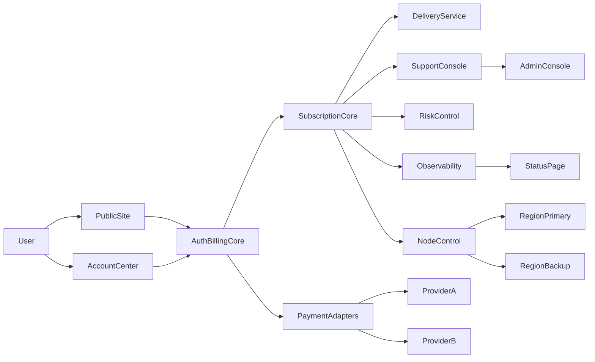

# 海外订阅服务平台架构

## 判断

现有仓库不是从零开始。

已经有可复用的账号、订阅、账本和后台基础，但它们当前更偏 `CodeSprite` 现有产品和国内计费场景。要承接海外订阅服务，合理做法不是推倒重来，而是沿着现有 `saas_api` 和前端账户中心扩展出一条边界清楚的新链路。

最需要避免的是两种做法：

- 把海外支付直接硬塞进现有人工充值页面
- 把订阅运营后台和现有 `ops` 运维工作区混成一套页面

## 1. 可复用基础

当前仓库里可以直接作为基础参考的模块：

| 能力 | 现有位置 | 用法建议 |
| --- | --- | --- |
| 账号与会话 | `saas_api/app/saas.py` | 继续复用账号、登录、`/api/me` 聚合思路 |
| 账本与订阅 | `saas_api/app/db.py` | 复用 `subscriptions`、`recharge_orders`、`ledger` 这套主干 |
| 计费思路 | `docs/billing-design.md` | 复用订单、入账、幂等和审计原则 |
| 用户中心 | `frontend/src/site/user/MeBillingPage.tsx` | 作为新的海外账单页参考，但不建议直接叠加旧流程 |
| 后台总览 | `frontend/src/site/admin/AdminHome.tsx` | 可延续 admin 信息架构，但需要独立“海外订阅运营”分区 |

## 2. 建议的平台拆分

## 3. 模块职责

### 3.1 PublicSite

负责对外公开信息：

- 套餐页
- 退款规则
- 支持渠道
- 状态页入口
- 法律文件入口

### 3.2 AuthBillingCore

负责用户、订单、订阅和账单主流程：

- 注册、登录、邮箱验证
- 创建订单
- 支付回调验签
- 订阅激活、续费、到期
- 用户账单展示

这里建议继续以关系库为真相源，不把缓存当账务主存储。

### 3.3 PaymentAdapters

这是必须单独拆出来的一层。

职责包括：

- 渠道配置
- webhook 验签
- 幂等处理
- 订单状态映射
- 退款和争议状态同步

这样做的原因是支付商随时可能更换，不能把支付商特有字段散在业务主逻辑里。

### 3.4 SubscriptionCore

负责订阅权益和生命周期：

- Trial 到 Monthly 的转换
- 当前周期、到期时间、暂停、取消
- 设备数和区域数限制
- 续费失败和宽限期策略

### 3.5 DeliveryService

负责用户交付，不负责底层网络资源运维本身。

建议职责：

- 生成或分发用户可见的订阅配置
- 控制失效和到期回收
- 记录配置交付历史
- 限制过于频繁的拉取和切换

### 3.6 RiskControl

负责最小风控和滥用治理：

- 注册和登录限速
- 试用滥用拦截
- 异常流量和异常设备切换告警
- 封禁、解封和申诉记录

### 3.7 SupportConsole

不是复杂客服系统，先做最小支持中台：

- 工单入口索引
- 订单、订阅、封禁和退款查询
- 用户通知模板
- 公告和事故说明入口

### 3.8 NodeControl

这里只管理节点库存和容量，不把它和面向用户的订阅逻辑绑死。

最小字段建议：

- 区域
- 供应商
- 成本
- 带宽
- 容量上限
- 当前在线率
- 告警状态

## 4. 数据边界

### 4.1 继续复用的主表

| 表 | 作用 |
| --- | --- |
| `users` | 用户主档 |
| `subscriptions` | 订阅状态 |
| `recharge_orders` | 订单主记录 |
| `ledger` | 入账、退款、调整等账本 |

### 4.2 建议新增或拆出的领域表

| 表 | 作用 |
| --- | --- |
| `payment_webhook_events` | webhook 原文、签名状态、幂等结果 |
| `payment_refunds` | 退款与争议记录 |
| `delivery_records` | 配置交付、更新、回收和失败日志 |
| `device_registrations` | 用户设备绑定和限制 |
| `abuse_events` | 滥用、封禁、申诉和处理记录 |
| `node_inventory` | 区域、供应商、容量、成本和健康状态 |
| `status_incidents` | 对外事故与公告记录 |
| `admin_audit_events` | 管理员改订阅、退款、封禁等关键操作 |

## 5. 接口分层建议

### 5.1 用户侧

- `GET /api/me`
- `GET /api/me/billing`
- `GET /api/me/subscription`
- `POST /api/billing/orders`
- `POST /api/me/subscription/cancel`
- `GET /api/me/deliveries`
- `POST /api/me/support/tickets`

### 5.2 支付侧

- `POST /api/billing/webhooks/{provider}`
- `POST /api/admin/billing/refunds`
- `GET /api/admin/billing/orders`

### 5.3 运营后台

- `GET /api/admin/users`
- `GET /api/admin/subscriptions`
- `GET /api/admin/abuse-events`
- `POST /api/admin/subscriptions/{id}/suspend`
- `POST /api/admin/subscriptions/{id}/resume`
- `POST /api/admin/users/{id}/ban`
- `POST /api/admin/users/{id}/unban`

### 5.4 平台运维

- `GET /api/admin/nodes`
- `GET /api/admin/nodes/health`
- `GET /api/admin/status/incidents`
- `POST /api/admin/status/incidents`

## 6. 前后端边界建议

### 6.1 前端

建议保持三块界面分区：

- 公开站点
- 用户账户中心
- 运营后台

不要把海外订阅后台塞进现有 `ops` 资产工作区，也不要继续把 `App.tsx` 当总控页面往里堆。

### 6.2 后端

建议保持同一个 `saas_api` 服务进程内扩展，但路由命名要分清：

- 用户与账单
- 支付回调
- 运营后台
- 平台运维

这样上线和回滚都更稳，不必一开始拆成多个微服务。

## 7. 安全边界

必须守住下面几条：

- 支付回调必须签名校验和幂等处理
- 管理员高风险操作必须写审计日志
- 订阅状态和节点状态不要混存在一份前端可写状态里
- 第三方密钥、支付密钥、供应商凭据不能进入普通业务状态对象
- 节点库存和容量数据需要和用户配置交付数据分层存储

## 8. 阶段性落地顺序

建议实施顺序：

1. 先补业务表和 webhook 事件表
2. 再补用户账单页和后台订单页
3. 然后补交付记录、封禁记录和设备限制
4. 最后再扩节点库存和状态页

原因是账单、订阅和审计是最难补历史账的，应该先稳定下来。
