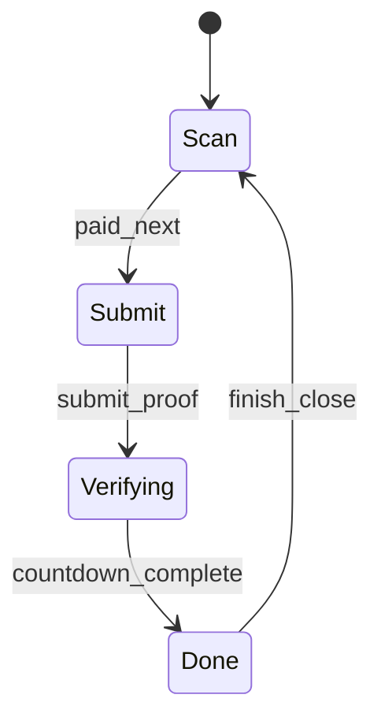

# CodeSprite（码灵）账号中心（/me）线框与交互规范（2026 v1）

本文覆盖 **个人中心 `/me/*`** 的页面结构与关键交互，目标是把“充值/订阅/流水”做成可落地闭环，并与官网/产品端保持一致的状态与文案。

事实来源：

- 路由：`frontend/src/RouterApp.tsx`
- 页面壳：`frontend/src/site/public/layout.tsx`
- 个人中心：`frontend/src/site/user/MeHome.tsx`
- 充值中心：`frontend/src/site/user/MeBillingPage.tsx` + `MeBillingPage.css`
- 交互设计参考：`docs/billing-ui-redesign-2026.md`

## 1. 页面结构总览（/me 侧栏 + 内容区）

### 1.1 布局线框（Desktop）

```text
┌──────────────────────────────────────────────────────────────────────────┐
│ PublicHeader (sticky)                                                    │
├──────────────────────────────────────────────────────────────────────────┤
│ Title: 个人中心                                                          │
│ Sub: 在这里管理你的余额、充值、订阅与消费流水。                            │
├──────────────┬───────────────────────────────────────────────────────────┤
│ SideNav      │ Content                                                   │
│ - 概览       │ (route outlet)                                             │
│ - 充值       │                                                           │
│ - 订阅与到期 │                                                           │
│ - 设备与登录态│                                                           │
│ - 账号资料   │                                                           │
└──────────────┴───────────────────────────────────────────────────────────┘
```

### 1.2 子路由（真实存在）

- `/me`：概览
- `/me/billing`：充值中心（完整闭环）
- `/me/subscription`：占位（后续补齐“订阅与到期”专页）
- `/me/devices`：占位（后续补齐“设备与登录态”）
- `/me/profile`：占位（后续补齐“账号资料”）

> 建议：/me 应与 `/app` 一样加登录门禁（当前代码未强制），避免匿名访问出现“请求失败/闪烁”。

## 2. `/me` 概览页（MeOverview）

### 2.1 目标（Jobs-to-be-done）

- 快速确认：余额、订阅状态、每月赠送额度、到期日
- 快捷入口：去充值中心、进入网页版使用（/app）

### 2.2 线框

```text
┌───────────────────────────────────────────────────────────────┐
│ HeaderRow                                                     │
│  Left: 标题“概览” + 描述（加载中/加载失败/说明）               │
│  Right: [去充值中心] [进入网页版使用]                          │
├───────────────────────────────────────────────────────────────┤
│ Error (可选，红色块，pre-wrap)                                 │
├───────────────────────────────────────────────────────────────┤
│ StatCards (3列)                                                │
│  - 余额：¥xx.xx（tabular-nums）                                │
│  - 订阅：PRO + Badge(已开通/试用中/未开通) + 到期日期           │
│  - 每月赠送额度：¥xx.xx                                        │
└───────────────────────────────────────────────────────────────┘
```

### 2.3 状态与错误

- loading：卡片值显示 `—`；描述显示“加载中…”
- error：显示错误块；描述显示“加载失败”
- subscription badge：
  - active：绿色 `已开通`
  - trialing：主色 `试用中`
  - else：灰色 `未开通`

## 3. `/me/billing` 充值中心（MeBillingPage）

> 这是当前最完整的“资金闭环”页面：充值（手工入账）+ 续费扣款 + 订单/流水查询。

### 3.1 页面区块拆分（概览 + 充值 + 订阅 + 记录）

```text
┌───────────────────────────────────────────────────────────────┐
│ PageHeader                                                    │
│  Title: 充值中心                                              │
│  Sub: 余额可用于订阅续费及按量服务抵扣。                        │
│  Right: 当前用户(脱敏) + [刷新]                                │
├───────────────────────────────────────────────────────────────┤
│ ErrorBanner（可选：余额不足/网络异常/提交失败等）               │
├───────────────────────────────────────────────────────────────┤
│ PromoHero（首月特惠）                                          │
│  - 仅限首单 Tag                                                │
│  - 文案：注册后 N 天内可享 / 已使用 / 不在窗口                  │
│  - PricingGrid（3档）：支付金额 + 赠送 + 实得                   │
│  - 点击档位 -> 打开「收银台」Modal（4步）                       │
├───────────────────────────────────────────────────────────────┤
│ TopGrid（两卡）                                                │
│  - 当前余额：¥xx.xx                                            │
│  - 订阅状态：PLAN + Badge + 到期日 + [续费1月] [续费1年]         │
├───────────────────────────────────────────────────────────────┤
│ HistoryCard                                                   │
│  Tabs：充值订单 | 资金流水                                     │
│  List：最多 12 条（空态：暂无订单/暂无流水）                    │
└───────────────────────────────────────────────────────────────┘
```

### 3.2 收银台 Modal（4 步向导）

状态机（与代码一致：`scan`/`submit`/`verifying`/`done`）：



#### Step1：扫码付款（scan）

```text
Title: 收银台
StepIndicator: ●●●
金额：¥xx.xx
二维码：/api/pay/qr/alipay 或 /api/pay/qr/wxpay
渠道切换：支付宝 | 微信
主按钮：[我已支付，下一步]
```

关键规则：

- 渠道切换只影响二维码与文案，不改变金额
- 关闭按钮：仅在非 verifying 时显示（避免误关导致用户迷失）

#### Step2：提交凭证（submit）

```text
Title: 提交凭证
说明：手工到账；提交后状态=submitted
备注 textarea（建议：邮箱/手机号后四位 + 金额）
上传截图 input (≤2MB, image/*)
预览：有图 -> img；无图 -> “未选择截图”
按钮：[返回扫码] [提交]
```

失败态（必须可恢复）：

- 截图>2MB：提示“截图太大…请压缩后再上传”
- 提交失败：显示错误 banner（不关闭 modal）
- 网络异常：显示错误 banner，并允许重试提交

#### Step3：确认中（verifying）

```text
Spinner
文案：请耐心等待 (3s...)
```

说明：当前实现是倒计时模拟；后续接入真实审核/回调后，应改成“等待入账（可刷新订单）”。

#### Step4：完成（done）

```text
成功 icon ✓
标题：¥xx.xx 已提交凭证
订单号：{orderId}
说明：管理员核对后一键入账…
主按钮：[完成] -> 关闭 modal + refresh
```

### 3.3 订阅续费确认 Modal（扣余额）

触发：点击 `续费 1 月 / 续费 1 年` 打开确认弹窗。

```text
Title: 确认续费？
Body: 将从余额扣除 ¥xx.xx 用于续费 N 个月 PRO 会员
      当前余额：¥xx.xx
Buttons: [取消] [确认支付]
```

错误与提示：

- 余额不足：必须明确“当前/需要”并引导“先充值后续费”（代码已实现 `InsufficientBalance` 友好错误）
- 成功后：关闭弹窗 + refresh 页面数据

### 3.4 记录区（订单/流水）

#### 订单（orders）

字段（现状展示）：

- 日期（created_at）
- 描述（渠道+订单号前缀）
- 金额（amount_cents）
- 状态（credited 显示 `已到账`，否则展示 status 原值）

建议补齐（目标态）：

- 状态映射：submitted=审核中（橙色）、credited=已到账（绿色）、rejected=已驳回（红色）
- 行点击：打开订单详情 Drawer（包含凭证/备注/状态流转/审计）

#### 流水（ledger）

字段（现状展示）：

- 日期（created_at）
- entry_type（例如 recharge/subscription_charge）
- 金额（正数绿色/负数红色）
- period（可选）

建议补齐（目标态）：

- entry_type 友好化：充值入账/订阅扣费/赠送额度
- ref_id 可点击（跳到关联订单/订阅）

### 3.5 管理员区块（仅 admin 可见）

目的：在无自动回调/对账时，提供“审核入账”的最小闭环。

```text
Card: 管理员：待入账（submitted）
TopRight: [刷新列表]
ListRow:
 - 订单号 + uid + 渠道 + 金额
 - 备注（pre-wrap）
 - 时间
 - Actions: [查看截图] [一键入账]
```

关键风险控制（UI 侧最小要求）：

- “一键入账”应二次确认（建议补齐），并在成功后刷新列表与用户余额
- 展示“入账会写入 ledger（recharge + promo_credit）”的说明（现状已有）

## 4. `/me/subscription`、`/me/devices`、`/me/profile`（占位页→目标态）

当前为 Stub；这里定义目标态结构，便于后续补齐页面。

### 4.1 订阅与到期（目标态）

```text
Title: 订阅与到期
Card: 当前计划 + 状态 + 到期日 + 自动续费开关（可选）
Card: 历史扣费记录（按月）
CTA: [去充值中心] [升级到团队版]（如适用）
```

### 4.2 设备与登录态（目标态）

```text
Title: 设备与登录态
List: 设备名/最近活跃/地点(可选)/IP(脱敏)
Actions: [下线该设备] [下线全部]
```

### 4.3 账号资料（目标态）

```text
Title: 账号资料
Profile: 手机/邮箱（脱敏）/注册时间
Security: 修改密码/绑定邮箱（可选）
```

## 5. 验收清单（/me 视角）

- 概览：加载中/失败/成功三态清晰；金额用等宽数字；到期日格式统一
- 充值中心：收银台 4 步可闭环，错误可恢复；上传限制明确；提交成功后能看到订单进入列表
- 续费：扣款确认清晰；余额不足提示包含“当前/需要”；成功后订阅状态与到期日刷新
- 记录：订单/流水 tab 切换稳定；空态明确；列表字段可扫描
- 管理员：能拉取 submitted 列表、查看截图、一键入账后余额/流水更新

