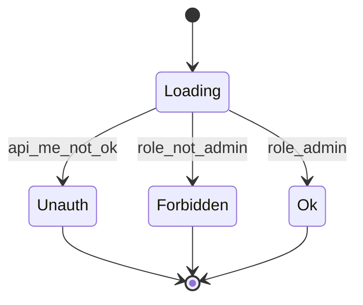

# CodeSprite（码灵）后台管理（/admin）线框与交互规范（2026 v1）

本文覆盖 **后台管理 `/admin/*`** 的页面结构、门禁状态与关键交互，目标是做到“可用的最小闭环 + 为后续订单/流水/审计预留扩展点”。

事实来源：

- 路由：`frontend/src/RouterApp.tsx`
- 登录页：`frontend/src/site/admin/AdminLoginPage.tsx`
- 门禁：`frontend/src/site/admin/AdminGate.tsx`
- 页面壳：`frontend/src/site/admin/AdminLayout.tsx`
- 主页面：`frontend/src/site/admin/AdminHome.tsx`

## 1. Admin 门禁（AdminGate）

### 1.1 状态机（UI 视角）



### 1.2 各状态 UI 规范

- Loading：短文本，避免 layout shift（现状：`正在验证管理员登录态…`）
- Unauth：重定向到 `/admin/login?next=...`（现状实现）
- Forbidden：展示“无权限访问后台 + 联系管理员”
- Ok：渲染后台页面

## 2. /admin 页面壳（AdminLayout）

### 2.1 Header 线框

```text
┌──────────────────────────────────────────────────────────┐
│ Brand(码灵) + “后台管理”           [返回官网] [账号(脱敏)] [退出] │
└──────────────────────────────────────────────────────────┘
```

规范：

- `minimalHeader=true`（登录页）时显示“返回官网”
- 已登录时展示账号脱敏（`ab***@xx.com`）
- 退出登录：调用 `/api/auth/logout`，完成后跳转回 `/admin/login?next=%2Fadmin`

### 2.2 Footer

- 固定提示：`内部后台 · 仅授权人员使用`

## 3. `/admin/login` 后台登录页（AdminLoginPage）

### 3.1 目标（Jobs-to-be-done）

- 管理员输入邮箱/密码，登录后进入 `/admin` 或安全的 `next`
- 明确“普通用户不可用”，由 `AdminGate` 负责 Forbidden 提示

### 3.2 线框

```text
┌──────────────────────────────────────────────────────────┐
│ Title: 后台管理登录                        [返回官网]        │
├──────────────────────────────────────────────────────────┤
│ Card                                                        │
│  - 管理员邮箱 input (autocomplete=username)                  │
│  - 密码 input (Enter 提交)                                   │
│  - ErrorBlock（红色）                                        │
│  - [登录]                                                    │
│  - Hint：忘记密码？联系管理员/查看手册                         │
└──────────────────────────────────────────────────────────┘
```

关键规则：

- `next` 安全：只允许同源 path（现状实现）
- 错误友好化：解析 FastAPI `{detail: ...}`，输出中文提示

## 4. `/admin/*` 主页面（AdminHome）

### 4.1 总体布局（左侧导航 + 右侧内容）

```text
┌──────────────────────────────────────────────────────────┐
│ Title: 后台管理                                             │
│ Sub: 目标说明                                               │
├───────────────┬───────────────────────────────────────────┤
│ SideNav        │ Content                                    │
│ - 总览（统计） │ route outlet                               │
│ - 用户列表     │                                           │
│ - 充值订单     │                                           │
│ - 消费流水     │                                           │
└───────────────┴───────────────────────────────────────────┘
```

### 4.2 `/admin` 总览（统计）

依赖接口：`GET /api/admin/stats`

状态：

- loading：`加载中…`
- error：红字 `加载失败：...` / `网络异常：...`
- ok：3 张 StatCard
  - 用户总数
  - 活跃订阅（月付）
  - 试用即将到期

线框：

```text
Title: 总览（统计）
Desc: 内测阶段先做最小统计...

[StatCard 用户总数] [StatCard 活跃订阅] [StatCard 试用到期]
```

### 4.3 `/admin/users` 用户列表（搜索 + 分页）

依赖接口：`GET /api/admin/users?q=&page=&page_size=20`

线框：

```text
Title: 用户列表
Toolbar: [搜索输入] [搜索按钮] [返回总览]
StateRow: 共 N 条（note）

Table:
  ID | 账号(identifier) | 角色 | 禁用 | 试用到期

Pager: [上一页] 第 P 页 [下一页]
```

关键规范：

- 搜索点击后强制回到第 1 页（现状实现）
- 账号字段展示需脱敏策略（目标态）：手机号中间打码/邮箱打码（目前直接展示 identifier，应补齐）
- 后续动作预留位（目标态）：
  - 禁用/解禁按钮（需二次确认 + 审计）
  - 重置密码（企业内测可选）

### 4.4 `/admin/orders` 充值订单（占位 → 目标态）

当前 Stub（占位）说明“后端接入后支持分页/搜索/导出”。

目标态建议：

```text
Title: 充值订单
Toolbar: [状态筛选 submitted/credited/rejected] [时间范围] [搜索(订单号/用户)] [导出]
Table:
  订单号 | 用户 | 渠道 | 金额 | 状态 | 创建时间 | 入账时间 | 操作(查看凭证/一键入账)
Drawer:
  订单详情（截图/备注/状态流转/审计）
```

风险控制（必须）：

- 一键入账必须二次确认
- 所有状态变更写审计日志（谁在何时对哪个订单做了什么）

### 4.5 `/admin/ledger` 消费流水（占位 → 目标态）

目标态建议：

```text
Title: 消费流水
Toolbar: [时间范围] [用户筛选] [entry_type筛选] [导出]
Table:
  流水号 | 用户 | 类型 | 金额(+/-) | period | ref_id | 创建时间
```

规范：

- 金额正负颜色一致（+success / -danger）
- ref_id 可点击跳转到对应订单/订阅扣费记录

## 5. 验收清单（/admin 视角）

- 门禁：unauth 自动重定向；forbidden 提示明确且不泄露敏感信息
- 登录：next 安全；错误文案友好；Enter 可提交
- 总览：loading/error/ok 三态清晰
- 用户列表：分页稳定；搜索不会卡死；敏感字段脱敏（目标态必须补）
- 订单/流水：即使占位也要把目标态结构与扩展点明确（便于排期）

