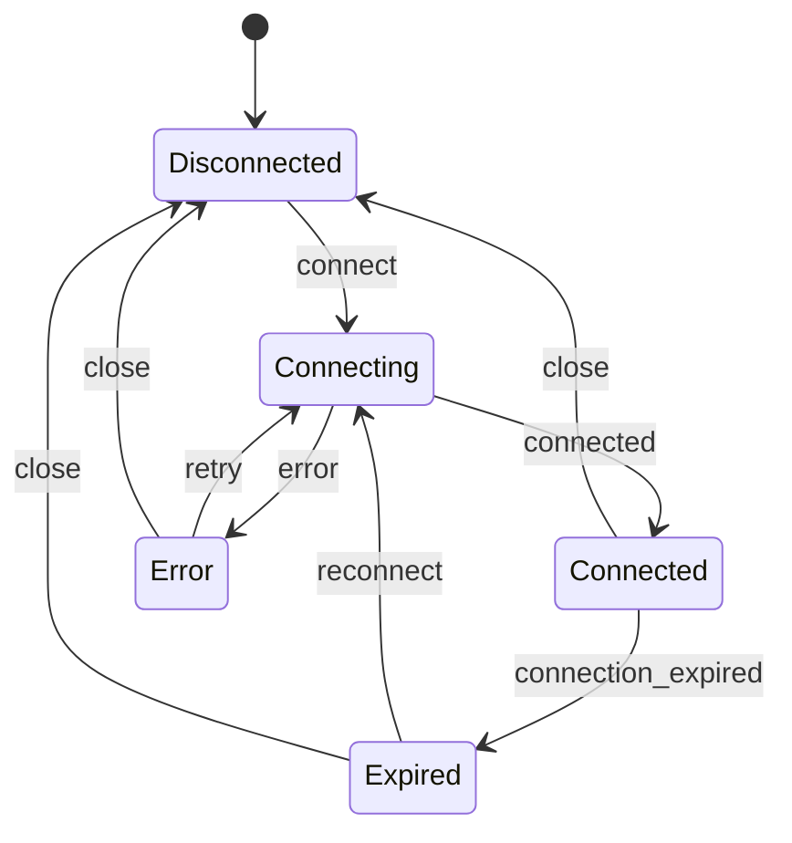

# CodeSprite（码灵）/app（控制台+工作区）线框与交互规范（2026 v1）

本文是 **/app 产品端** 的“可直接落地”线框与交互规格，目标是让前端按此拆分组件即可实现一致体验。

参考与对齐：

- 交互总规格：`docs/product/console-dashboard-interaction-spec.md`
- 资产/主机设计：`docs/host-config-design.md`、`docs/ui-host-config-ui-spec.md`
- 设计系统：`docs/ui/archive/ui-design-system.md`（草稿）与 `frontend/src/ui/*`（现行实现）
- 现有实现骨架：`frontend/src/App.tsx`、`frontend/src/App.css`、`frontend/src/host-config/HostSidebar.tsx`

## 1. /app 信息架构（mode 映射）

| mode | 入口标签 | 主目的 | 侧栏承载 | 主区承载 |
|---|---|---|---|---|
| dashboard | 控制台 | 引导下一步、总览 | 快捷入口 / 最近访问 | KPI、Quick Actions、最近/主机/工作区列表 |
| chat | 聊天 | 问答与会话管理 | 会话列表 | 聊天流 + 输入区 + 模型选择 |
| ssh | 资产管理 | 资产+工作区闭环 | 工作区列表 + Inventory（资产库） | 右侧详情（Workspace/Asset/空状态） |
| plugins | 插件 | 扩展能力与集成 | 插件分类/搜索（后续） | 插件列表/详情/安装与更新 |

## 2. 全局布局线框（Desktop）

> 现有布局是“左侧 sidebar + resizer + main”，移动端收敛为侧栏抽屉（已实现）。

```text
┌──────────────────────────────────────────────────────────────────────────────┐
│ Sidebar (Tabs + Lists + UserCard) │ Resizer │ Main (Topbar + Body + Footer)  │
│                                                                          ... │
└──────────────────────────────────────────────────────────────────────────────┘
```

### 2.1 Sidebar 结构（通用）

```text
┌──────────────────────────┐
│ Brand + Context Switcher  │  (workspace/context，后续可扩展)
├──────────────────────────┤
│ Tabs: 控制台/聊天/资产/插件 │
├──────────────────────────┤
│ SidebarBody (mode-specific)│
├──────────────────────────┤
│ Footer: subscription cards │
│ UserCard + user menu       │
└──────────────────────────┘
```

交互规范：

- Tab 切换：保留每个 mode 的局部状态（搜索词、选中项、滚动位置）优先；必要时才 reset。
- 侧栏列表动作：默认 **hover 才显示**（避免信息噪音），键盘 focus 也应显示。
- 侧栏宽度：拖拽改变；双击 resizer 恢复默认（现有实现）。

## 3. Dashboard（控制台）线框与交互

对齐 `docs/product/console-dashboard-interaction-spec.md` 1.x。

### 3.1 Dashboard 主线框

```text
┌──────────────────────────────────────────────────────────────┐
│ Topbar: 控制台 > 概览                      [全屏/退出全屏]     │
│        subtitle: 资产、工作区与快捷入口                       │
├──────────────────────────────────────────────────────────────┤
│ Banner (可选): 断连/告警/提示                                 │
│ KPI: [资产主机] [活跃工作区] [已装插件] [本月对话]             │
│ QuickActions: [新建主机] [导入资产] [安装插件] [发起对话]       │
│ Tabs: 最近访问 | 我的主机 | 活跃工作区                         │
│ List: 行项目（带 hover actions：连接/文件/编辑/删除）           │
└──────────────────────────────────────────────────────────────┘
```

### 3.2 新手引导（assets=0）与锁定展示

- 当资产数为 0：展示 Step1 “新增主机（主 CTA）”；Step2/3 置灰锁定并说明解锁条件。
- 解锁条件建议：完成新增主机 + 创建工作区（或成功连接）。
- 锁定态用 **一致样式**：降低 opacity + lock icon + tooltip 说明。

### 3.3 KPI 点击行为（强一致）

- 点击 KPI 必须“可预测”：直接切到目标 mode，并聚焦到对应对象列表区域。
  - 资产主机 -> `ssh`（资产管理）并展开 Inventory
  - 活跃工作区 -> `ssh` 并定位工作区列表
  - 已装插件 -> `plugins`
  - 本月对话 -> `chat`

## 4. 资产管理（ssh mode）线框与交互

核心骨架：左侧 `HostSidebar`（工作区 + Inventory），右侧显示 Workspace/Asset 的详情视图。

### 4.1 ssh mode 主线框

```text
┌──────────────────────────────┬──────────────────────────────────────────────┐
│ SidebarBody (HostSidebar)     │ Main                                         │
│ ┌───────────────┐            │ ┌──────────────────────────────────────────┐ │
│ │ 工作区列表      │            │ │ Header: 当前选择（工作区/资产/空状态）    │ │
│ │ 搜索            │            │ ├──────────────────────────────────────────┤ │
│ │ 置顶/按项目/其他 │            │ │ Body: 详情卡 / 引导 / 空状态              │ │
│ ├───────────────┤            │ └──────────────────────────────────────────┘ │
│ │ 资产库Inventory  │ (+) +WS 编辑│                                              │
│ └───────────────┘            │                                              │
└──────────────────────────────┴──────────────────────────────────────────────┘
```

### 4.2 HostSidebar（工作区列表）

对齐现有 `frontend/src/host-config/HostSidebar.tsx`：

- 搜索：
  - placeholder：`搜索工作区/资产...`
  - debounce 300ms
  - token 化：空格分词 AND（符合 `docs/host-config-design.md` 建议）
- 分组（工作区层）：
  - 置顶（Pinned）
  - 按项目（Project）
  - 其他/列表（无 project）
- Row Actions（hover 出现）：
  - 置顶/取消置顶
  - 删除（confirm：不会删除主机）

### 4.3 Inventory（资产库）

对齐现有实现：

- 折叠/展开：标题行点击切换（显示 ▼/▶）
- 右侧 `+`：新增主机（stopPropagation；避免误触发折叠）
- 资产行 hover actions：
  - `+WS`：从该资产创建工作区（进入创建 Drawer）
  - `编辑`：打开主机编辑器

空状态规范：

- 搜索命中为空：`无匹配资产`（并提供“清除搜索”）
- 无资产：`暂无资产` + 主 CTA `添加主机`

## 5. 工作区（Workspace）与连接状态机（核心）

> UI 必须让用户清楚：**我在哪里、是否连接、能做什么、失败怎么恢复**。

### 5.1 连接状态机（UI 视角）



### 5.2 状态展示规范（Status Pill + Next Action）

统一在右上角/Topbar 放一个状态 pill（可点击打开“连接设置/重连”）：

- Disconnected：灰点 + `未连接`，主操作 `连接`
- Connecting：转圈 + `连接中…`，次操作 `取消`
- Connected：绿点 + `已连接`，次操作 `断开`
- Expired：红点 + `已断开`，主操作 `重新连接`（文案需要说明密码登录需重输）
- Error：红点 + `连接失败`，主操作 `重试`，并提供“查看原因”（可折叠）

### 5.3 工作区视图推荐布局（目标态）

> `docs/product/asset-workspace-mvp-spec.md` 要求“像 Cursor 一样”：文件 -> 编辑器 Tabs -> AI -> 写回门禁 -> 审计/回滚。MVP 可以先用 Drawer/Panel 组合逐步落地。

```text
┌──────────────────────────────────────────────────────────────────────────────┐
│ WorkHeader: 工作区·{host.name}·{host.address}:{port}      [状态pill] [⋯]     │
├──────────────────────────────────────────────────────────────────────────────┤
│ Split: FileTree | EditorTabs | SidePanel(AI/审计/变更)                         │
│       (可折叠)    (可只读/可写) (默认 AI)                                     │
├──────────────────────────────────────────────────────────────────────────────┤
│ Bottom: Terminal (受控) + 只读探测快捷按钮（vmstat/iostat 等）                 │
└──────────────────────────────────────────────────────────────────────────────┘
```

### 5.4 AI 写回门禁（UI 必须）

两段式（生成 diff / 应用补丁）：

- 生成阶段：展示“影响文件清单 + diff 预览”
- 应用阶段：必须二次确认（Confirm Modal / confirm token），并明确：
  - 将写入哪些文件
  - 是否自动提交（如启用）
  - 如何回滚（revert / 备份）

验证点（UI 反馈必须包含）：

- 写入后展示 `git diff`/摘要（或至少展示“写入成功 + 影响文件”）
- 写入/回滚动作进入审计事件列表（先占位 UI，也要预留入口）

## 6. 菜单、弹窗、抽屉的统一规则

### 6.1 Menu（右键/⋯/更多）

- 定位：自动贴边（避免溢出屏幕）
- 关闭：点击空白/滚动/Esc
- 危险项：使用 danger 颜色并放在分隔线下方

### 6.2 Modal（表单/确认）

- 表单型：支持滚动；Footer 固定动作条（取消/保存）
- 确认型：小尺寸（Compact），只给必要信息（不可撤销/影响范围）
- 所有 Modal：Esc/点击遮罩关闭（危险动作的 confirm 可要求显式点击按钮关闭）

### 6.3 Drawer（创建工作区等）

创建工作区 Drawer（对齐现状）字段规范：

- 工作区名称（必填，1..64）
- rootPath（必填，提供示例 ` /srv/www `；Windows 支持 `C:/Users/...`）
- 创建后置顶（可选）

提交后行为：

- Toast：`已创建工作区：{name}`
- 自动设为 active，并将 mode 切到工作区相关视图（或保持 ssh mode，但右侧展示新工作区详情）

## 7. Plugins（插件中心）线框与交互

当前已有“已装/可更新/未安装”的展示基础（`docs/product/console-dashboard-interaction-spec.md` 提到占位）。

推荐线框：

```text
┌──────────────────────────────────────────────────────────────┐
│ Header: 插件中心                         [搜索] [刷新]         │
├──────────────────────────────────────────────────────────────┤
│ List (Card/Row):                                                │
│  - Prometheus   已安装  可更新   [更新] [设置] [禁用]           │
│  - SFTP         已安装          [打开] [设置]                   │
│  - Kube         未安装          [安装]                          │
└──────────────────────────────────────────────────────────────┘
```

规范：

- 安装/更新：必须有 loading 与失败可重试；成功后 toast
- 插件权限（后续）：安装前展示“需要的权限”（读/写/网络/文件等），并支持拒绝

## 8. 组件映射表（落地拆分建议）

| 区域 | 建议组件 | 备注 |
|---|---|---|
| Sidebar Tabs | `TabPillGroup`（可复用现有 class） | 保持紧凑 pill，移动端自动收敛 |
| 列表 Row | 统一 row 样式（含 hover actions） | 统一 title/meta/actions 三段结构 |
| Status Pill | `StatusPill` | 统一 dot + label + click 打开设置 |
| Confirm Modal | `ui/Modal`（后续抽象） | 统一 Esc/遮罩/aria/滚动锁定 |
| Drawer | `ui/Drawer`（后续抽象） | 统一右侧滑入、Header/Body |
| Toast | `Toast` | 统一在右下角堆叠 |

## 9. Chat（聊天 mode）线框与关键交互（补齐）

> 本节补齐聊天页的“会话管理 + 模型选择 + 清空确认 + 生成中断”等关键交互点（不重写前文结构）。

### 9.1 Chat 主线框（Desktop）

```text
┌──────────────────────────────────────────────────────────────┐
│ Topbar: Chat 标题 + 右上角后端状态 pill（可点开 API Base 设置） │
├──────────────────────────────────────────────────────────────┤
│ Messages（滚动区域）                                          │
│  - User bubble                                                │
│  - Assistant bubble                                           │
│  - Tool bubble（系统状态/命令结果等）                          │
├──────────────────────────────────────────────────────────────┤
│ Composer                                                     │
│  - Textarea（Enter 发送，Shift+Enter 换行）                    │
│  - Model Select（加载中/不可用/可选）                          │
│  - Action：发送 / 暂停（生成中）                               │
│  - Hint：Enter 发送 · Shift+Enter 换行                         │
└──────────────────────────────────────────────────────────────┘
```

### 9.2 会话列表（SidebarBody）

```text
┌──────────────────────────┐
│ Header: 会话              │
│  [新建会话]  [⋯/更多]      │
├──────────────────────────┤
│ SessionList（可滚动）      │
│  - SessionRow: title/meta │
│    hover actions: ⋯        │
└──────────────────────────┘
```

关键交互：

- 新建会话：创建新 session 并插入欢迎消息（toast/inline 均可）
- 会话行“⋯”菜单：
  - 关闭/删除（危险项）
  - 清空聊天（见 9.4）

### 9.3 模型选择（Model Select）

状态：

- loading：disabled + 文案 `模型列表加载中…`
- unavailable：disabled + 文案 `无法获取模型列表`
- ok：按 optgroup/列表展示，并持久化选择（localStorage）

规范：

- 不要把“模型选择”埋得太深：默认放在输入区附近（当前实现如此）
- 当后端不通时，模型选择需明确不可用原因（配合后端状态 pill）

### 9.4 清空聊天确认（Compact Modal）

触发：

- 会话菜单 → 清空聊天
- 或页面内显式入口（如果保留）

线框：

```text
Title: 清空当前聊天记录
Body: 这会清空当前会话的聊天消息记录，且无法撤销。
Buttons: [取消] [清空聊天]
```

规则：

- 必须二次确认（不可撤销）
- 清空后给出 toast：`已清空聊天记录`

### 9.5 生成控制（Stop）

- 生成中：输入区按钮显示 `暂停`；停止后在消息尾部标记“（已暂停）”
- 停止必须是可恢复的：用户可继续输入再次发起生成


