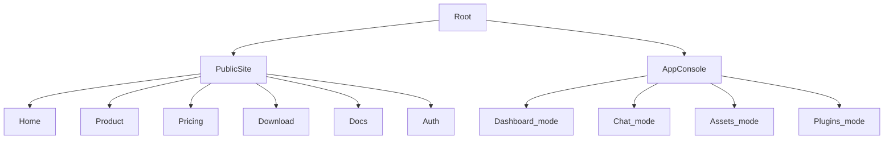

# CodeSprite（码灵）UI 规格说明（2026 v1）

本规范用于统一 CodeSprite 多端面的 UI 体验，并确保后续前端能**按规范直接落地**：

- **产品端（/app）**：控制台（dashboard）/聊天（chat）/资产管理（ssh）/插件（plugins）+ 关键弹窗/抽屉
- **官网端（public site）**：Home/Product/Pricing/Download/Docs/Auth
- **账号中心（/me）**：余额/充值/订阅/流水
- **后台（/admin）**：统计/用户/订单/流水
- **桌面端（Tauri + Installer）**：安装器向导 + 客户端关键设置（API Base）

设计语言以“Cursor-like 暗色磨砂 + 高密度工具型 UI”为基线，复用现有设计系统与组件库。

## 1. 现有基线（必须对齐）

- **设计系统**：`docs/ui-design-system.md` 已定义 token 与基础组件（`frontend/src/ui/*`）及迁移策略（只新增 `ui-` 前缀样式/组件，避免破坏旧样式）。
- **token 来源**：`frontend/src/ui/tokens.css`（并对旧变量 `--bg/--panel/--border/...` 做了 alias）。
- **控制台/资产管理交互规格**：`docs/product/console-dashboard-interaction-spec.md`（已对齐 `mode=dashboard/chat/ssh/plugins`）。
- **工作区优先的产品设计**：`docs/product/asset-workspace-mvp-spec.md`（定义“像 Cursor 一样”的工作区闭环与门禁/审计理念）。

## 2. 设计目标（Outcome）

- **一致性**：同一对象（Workspace/Asset/Plugin/Plan）在不同页面的命名、状态、操作入口一致。
- **高密度但可扫描**：列表优先“扫一眼就懂”，详情优先“结构化信息 + 可复用动作条”。
- **安全与可恢复**：任何可能造成写入/破坏的动作都有“门禁 + 可回滚 + 结果可验证”的 UI 反馈。
- **可观测与可审计（为后续预留）**：UI 状态机清晰，错误分类明确（用户能自助恢复；运维能定位原因）。
- **跨端复用**：Web 与桌面端（Tauri）尽量复用同一套 UI 模式与组件。

## 3. 信息架构（IA）与路由地图（统一口径）

### 3.1 顶层 IA（Public + App）

### 3.2 公共导航（Public Header）

**固定菜单**（已存在骨架：`frontend/src/site/public/layout.tsx`）：

- 产品（`/product`）
- 价格（`/pricing`）
- 下载（`/download`）
- 文档（`/docs`，仅登录后显示）

**用户菜单（登录后）**：

- 进入控制台/工作区（`/app`）
- 账号设置（`/me`）
- 我的订阅（`/pricing` 或 ` /me/billing`，以实际产品策略为准）
- 退出登录

移动端：Hamburger 打开侧滑菜单（overlay + sheet），Esc/点击遮罩关闭。

### 3.3 产品端导航（/app Sidebar）

产品端侧栏以 mode 切换为主（与 `docs/product/console-dashboard-interaction-spec.md` 一致）：

- 控制台（dashboard）
- 聊天（chat）
- 资产管理（ssh）
- 插件（plugins）

侧栏承载“高频对象列表”（会话/工作区/资产/插件），主区域承载详情与工作流。

### 3.4 统一命名与展示格式（跨端一致）

#### 3.4.1 导航命名（用户可见）

| 概念 | Public Site 位置 | /app 位置 | 推荐中文口径 |
|---|---|---|---|
| 产品 | Header 导航 |（无）| 产品 |
| 价格 | Header 导航 |（无）| 价格 |
| 下载 | Header 导航 |（无）| 下载 |
| 文档 | Header 导航（登录后） |（无）| 文档 |
| 控制台 |（登录后入口）| Sidebar Tab | 控制台 |
| 聊天 |（无）| Sidebar Tab | 聊天 |
| 资产管理 |（无）| Sidebar Tab | 资产管理 |
| 插件 |（无）| Sidebar Tab | 插件 |

#### 3.4.2 对象展示格式（列表/详情统一）

- **Asset（主机）**：
  - title：`{name}`
  - meta：`{username@}{address}{:port}`（port=22 可省略；与 `frontend/src/host-config/HostSidebar.tsx` 一致）
  - tags：`env/project/tags` 以 badge 方式 wrap 展示
- **Workspace（工作区）**：
  - title：`{workspace.name}`（pinned 显示 📌）
  - meta：`{asset.address} : {workspace.rootPath}`（现状实现）
- **Plan（订阅）**：
  - badge：`Free/Pro/Team`（尽量短，不在 badge 里塞长文案）
  - 如果有到期：显示 `到期：YYYY-MM-DD`

## 4. 统一对象模型（UI 层）

> 这是 UI 的“统一字典”，用于跨端文案与状态一致性（不是后端数据模型）。

- **User**：登录态、角色（user/admin）、邮箱/手机号（展示需要脱敏）
- **Plan**：Free/Pro/Team；并携带 **能力开关**（可写/可用上下文大小/并发等）
- **Asset（资产/主机）**：name/address/port/username/project/env/tags（可扫描展示）
- **Workspace（工作区）**：name/rootPath/assetId/pinned/lastOpenedAt（主入口对象）
- **Plugin（插件）**：installed/hasUpdate/enabled（后续可加权限声明）
- **Release（版本）**：platform/kind/version/url/sha256/size/publishedAt（下载页）

## 5. 全局交互模式（Patterns）

### 5.1 信息密度与层级（推荐排版）

- **列表项（Row）**：一行主标题 + 一行副信息（meta）；右侧悬浮时出现 actions（“减少噪音”）。
- **详情页（Detail）**：Header（标题+副标题+动作条）+ Key/Value Rows（结构化字段）+ 辅助区块（审计/日志/提示）。
- **操作入口收敛**：
  - 高频：直接按钮（Primary/Default）
  - 低频：更多菜单（⋯）+ 分组
  - 移动端：默认收敛为“更多菜单”

### 5.2 反馈与可恢复（系统级）

统一使用三类反馈（优先级从高到低）：

- **Inline 状态**：组件内部的 loading/err（例如“正在加载版本列表…”）
- **Toast**：短提示，不打断（例如“已置顶：xxx”）
- **Modal/Confirm**：破坏性/不可逆动作的门禁（删除、写入、回滚等）

错误必须具备：

- **用户可理解**的原因（不要直接把堆栈抛给用户）
- **下一步**（重试/重新连接/查看说明/联系管理员）
- **可选技术信息**（折叠展示：requestId/错误码/时间等，为运维排障保留）

### 5.3 可访问性（A11y）底线

- 所有可点击元素必须可聚焦（`:focus-visible` 有 ring）
- Esc 关闭：Menu/Modal/Drawer/移动端导航
- 语义：
  - 菜单 `role="menu"`
  - 弹窗 `role="dialog"` + `aria-modal="true"`
  - 状态文本与按钮有明确 `aria-label`

## 6. token 与组件使用约束（实现口径）

### 6.1 token 约束

- **优先使用**：`--ds-*`（`frontend/src/ui/tokens.css`）
- **兼容旧样式**：可使用 `--bg/--panel/--border/...`，但新增页面/组件不再引入新的 legacy 变量
- **颜色语义**：
  - 主色：`--ds-accent`（强调/选中/Primary）
  - 成功：`--ds-success`（OK 状态点/成功提示）
  - 危险：`--ds-danger`（删除/失败/断连）

### 6.2 基础组件

以 `frontend/src/ui/*` 为准（Button/Input/Select/Menu/Badge/Card），并保持：

- 统一 hover/active/focus（参见 `frontend/src/ui/components.css`）
- 禁止在 JSX 文本节点内写 `\\uXXXX`（会原样渲染）；如需转义使用字符串字面量或直接 UTF-8 文案（对齐 `docs/host-config-design.md` 的规则）

## 7. 文案与状态标准化（跨端一致）

### 7.1 状态点（Status dot）与标签

- OK：绿色点（连通、可用、成功）
- WARN：黄色/橙色（可用但需注意：例如“待审核入账”）
- ERR：红色（断连、失败、不可用）

### 7.2 关键文案模板（建议统一抽象为 I18N）

- 断连：`连接已断开。你可以点击“重新连接”继续使用工作区。`
- 权限/门禁：`该操作会写入主机/文件。请确认影响范围后继续。`
- 试用/到期：`当前计划为只读。升级后可启用写回/自动提交/回滚。`
- 版本加载失败（下载页）：`版本列表加载失败：{err}（后端尚未部署时属于正常现象）`

## 8. 后续落地优先级与渐进迁移路线（建议）

> 原则：**最小化改动**，优先统一“高复用、高收益、易出错”的组件与交互；每一步都可回滚（只替换局部组件/样式，不大改结构）。

### 8.1 P0（立即收益最大：一致性 + 可用性）

- 抽象统一的 `ui/Modal`（表单/确认两种尺寸）
  - 统一 Esc/点击遮罩关闭策略、滚动锁定、ARIA
- 抽象统一的 `ui/Drawer`
  - 统一右侧滑入、Header/Body/Footer
- 列表行统一 title/meta/actions 三段结构与 hover/focus 行为（实现时可复用 Table/现有 row 样式）
  - 降噪：默认隐藏 actions；hover/focus 显示
- 抽象 `StatusPill`（dot + label + action）
  - 用于连接态/后端态/订阅态的统一入口

### 8.2 P1（体验增强：工作区“像 Cursor 一样”）

- 工作区内三栏布局（FileTree/EditorTabs/AIPanel）逐步替换占位卡片
- AI 写回两段式门禁 UI 固化（diff 预览 + confirm）
- 审计/变更记录 UI 占位先落地入口（即使后端尚未接入，也要有位置与状态说明）

### 8.3 P2（官网视觉与转化优化）

- 官网公共组件模块化（Hero/PlanCard/DocCard/Box），减少 inline style 分散
- Pricing -> Billing 的跳转策略统一（最终收敛到登录后的 `/me/billing`）
- Download：补齐真实截图/更新日志来源（releases note），提升可信度

## 9. 规格引用（后续文档）

- **页面全量清单（不漏页面/门禁/弹层）**：`docs/ui/page-inventory-2026.md`
- **产品端关键页面线框与状态机（/app）**：`docs/ui/app-console-wireframes.md`
- **官网端页面线框与内容模块（public site）**：`docs/ui/public-site-wireframes.md`
- **账号中心（/me）线框与交互**：`docs/ui/account-center-wireframes.md`
- **后台（/admin）线框与交互**：`docs/ui/admin-console-wireframes.md`
- **桌面端（安装器 + 客户端）线框与失败态**：`docs/ui/desktop-client-wireframes.md`

