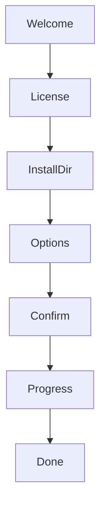

# CodeSprite（码灵）桌面端（安装器 + 客户端）线框与失败态规范（2026 v1）

本文覆盖两部分：

1) Windows 安装器（向导式安装，中文 UI）  
2) 桌面客户端（Tauri 壳 + 复用 Web UI 的关键设置/首次使用）

事实来源：

- Tauri 壳：`frontend/src-tauri/src/main.rs`、`frontend/src-tauri/tauri.conf.json`
- API Base 配置：`frontend/src/App.tsx`（`API_BASE_KEY=cursor_like_api_base_v1`，点击后端状态 pill 打开）
- Windows 安装器：`scripts/build-desktop-installer-csharp-wizard.ps1`

## 1. 桌面端总体架构（现实对齐）

- 桌面端窗口由 Tauri 提供（当前 `main.rs` 仅启动壳）。
- UI **复用 Web UI**（同一套 React 页面）。
- 桌面端相对于 Web 的核心差异：**默认后端地址**与“非同源”场景的 API 路由。

### 1.1 API Base 默认策略（关键）

来自 `frontend/src/App.tsx`：

- 若当前协议为 `http/https`：默认 API Base 为空（走同源 `/api/*`）
- 若为桌面端/文件协议：默认 API Base 为 `http://127.0.0.1:8030`

因此桌面端必须有一个**可见、可恢复**的“后端地址（API Base）设置”入口。

## 2. Windows 安装器（Wizard Installer）

### 2.1 页面流（真实存在）



### 2.2 各页线框（关键元素）

#### Welcome

```text
Title: {DisplayName} v{Version} 欢迎
Body: 欢迎使用安装向导，将安装到您的电脑。
Buttons: [下一步] [取消]
```

#### License（门禁页）

```text
Title: 许可协议
Body: 文本框（只读，可滚动）
Checkbox: 我已阅读并同意上述许可协议（未勾选禁用“下一步”）
Buttons: [上一步] [下一步] [取消]
```

#### InstallDir（选择目录）

```text
Title: 选择安装目录
Input: 安装路径（默认 %LocalAppData%\\Programs\\{AppId} 或已安装位置）
Button: [浏览...]
Buttons: [上一步] [下一步] [取消]
```

#### Options（安装选项）

```text
Title: 安装选项
Checkbox:
 - 创建桌面快捷方式（默认开）
 - 创建开始菜单快捷方式（默认开）
 - 开机自启动（默认关）
Buttons: [上一步] [下一步] [取消]
```

#### Confirm（确认安装）

```text
Title: 确认安装
Summary:
 - 下载地址
 - 安装目录
 - 快捷方式/自启动选择
Buttons: [上一步] [安装] [取消]
```

#### Progress（安装中）

```text
Title: 正在安装...
ProgressBar: 连续/Marquee（下载阶段可能为 Marquee）
Label: 进度：xx%
Log: 可滚动日志（带时间戳）
Buttons: （禁用所有导航，避免误触）
```

#### Done（完成）

```text
Title: 安装完成
Checkbox: 安装完成后启动程序（默认开）
Buttons: [完成]
```

### 2.3 覆盖升级（Upgrade Prompt）

触发：检测到之前已安装（通过注册表 InstallLocation）。

```text
Title: 是否覆盖安装
Body:
  检测到您之前已安装过客户端。是否要覆盖更新？
  说明：覆盖安装只会更新程序文件，不会删除原有设置和数据。
Buttons: [确定] [取消]
```

规则：

- 取消：退出安装器（返回码 2）
- 确定：继续安装流程，但默认安装目录应为已有 InstallLocation（就地覆盖）

### 2.4 关键失败态（必须可理解 + 可恢复）

#### 2.4.1 程序占用导致无法覆盖

现状会抛出错误：`无法覆盖程序文件，可能客户端正在运行…`

建议 UI 文案（保持一致）：  
`无法覆盖程序文件，可能客户端正在运行。请先退出客户端后重试。`

可恢复路径：

- 用户关闭客户端 → 重新运行安装器

#### 2.4.2 下载失败 / 网络异常

建议 UI 文案：

- `下载失败：{error}。请检查网络或稍后重试。`
- 在日志中保留更多细节（URL/HTTP 错误）

## 3. 桌面客户端（Tauri）关键页面与状态

> 桌面客户端 UI 复用 `/app`，这里仅补齐“桌面端必须额外可见”的关键页面/状态：首次使用、后端设置、更新提示（预留）。

### 3.1 首次启动（First Run）

目标：让用户明确“需要本机后端/或远程后端”，并给出一步到位的配置入口。

推荐结构（复用现有 UI 元素）：

```text
┌──────────────────────────────────────────────────────────────┐
│ 顶部：后端状态 pill（可点击）                                │
│ 主区：欢迎文案 + 快速检查（/api/health）                      │
│ CTA： [配置后端地址]（等价于点击状态 pill）                   │
└──────────────────────────────────────────────────────────────┘
```

状态：

- backend checking：`后端：检测中`
- backend ok：`后端：已联通`
- backend err：`后端：不可达`（提示“点击设置后端地址”）

### 3.2 后端设置 Modal（API Base Config）

触发：点击“后端状态 pill”（现状实现 `openApiCfg()`）。

线框（与现状 UI 对齐）：

```text
ModalTitle: 后端设置
Field: 后端地址（API Base）
Help:
  当前：<code>(same-origin /api) 或 http://127.0.0.1:8030</code>
  连通性：已联通 / 不可达（含 detail）
Buttons: [测试连通] [取消] [保存]
```

规则：

- 输入自动 trim 并去掉尾部 `/`
- 允许为空：表示同源 `/api/*`（对桌面端一般不建议，除非用户明确配置了远程站点反代）
- `测试连通` 必须是“可控超时”的快速检查（3~5s）

### 3.3 进入工作区（连接主机）Modal（桌面端同样适用）

触发：工作区/资产页点击“连接主机”。

线框（与现状实现对齐）：

```text
ModalTitle: 连接主机 · {host.name}
Field: rootPath（工作区根目录）
  QuickBtns: /root, C:/Users, C:/
AuthTabs: 密码 | 私钥 | Agent（仅本次使用，不落盘）
Primary: 连接并进入工作区
```

关键失败态：

- 连接失败：toast `连接失败：{reason}`
- 断连：toast `连接已断开，请点击“重新连接”继续`

### 3.4 更新提示（预留）

当前 Tauri 配置未启用 updater，但产品层应预留“更新提示/下载新版本”的 UI 模式：

- 触发条件（未来）：检测到 releases 有更新或服务端推送
- UI 形态：非打断 toast → 点击后打开 Drawer（展示版本号/更新内容/下载按钮/校验值）
- 风险控制：下载与替换应交给安装器/官方渠道，不在客户端内直接自更新（避免权限/锁文件问题）

## 4. 验收清单（桌面端）

- 安装器：许可勾选门禁生效；覆盖升级提示生效；程序占用报错清晰；安装完成可启动
- 客户端：首次启动能直观看到“后端状态”；后端设置可测试与保存；错误能自助恢复
- API Base：桌面端默认值为 `http://127.0.0.1:8030`；用户设置为空能回到同源模式（但需提示风险：可能指向静态站点导致返回 HTML）

